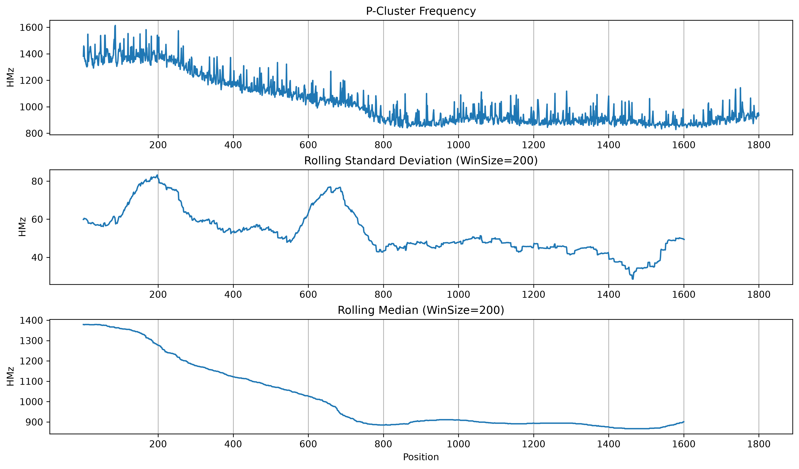
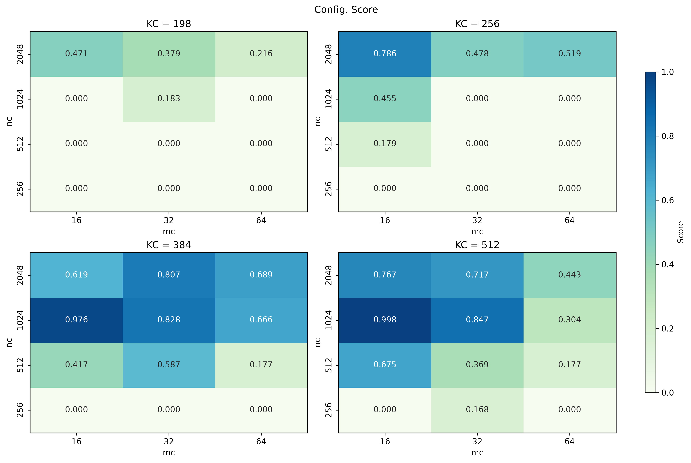

# GEMM Multi-Threads

A multi-threaded, BLIS-style GEMM implementation for Apple Silicon (ARM NEON). It benchmarks different blocking configurations (`MC` / `NC` / `KC`) under **heavy thermal throttling** to obtain a fair, realistic ranking.

The project started as C++ only. Analysing the benchmark data turned out to be much easier with Python tooling, so it is now a hybrid project. To quantify the thermal-throttling effect, `powermetrics` is run separately in a terminal. Three parts produce data:

| Part | Output | Description |
|------|--------|-------------|
| Terminal | `thermal_log.txt` | CPU metrics from `powermetrics` (sampled per second) |
| C++ | `./log/bench_runs.csv`, `./log/gemm_mThds.log` | GEMM performance per run |
| Python | `./data/integrated_bench.csv`, figures under `./png/` | Merges `bench_runs.csv` with `thermal_log.txt`, then analyses and plots |

> **Note:** Open a separate terminal, `cd` into `./log/`, and then start `powermetrics` (it requires `sudo`). This way `thermal_log.txt` is written to where the Python scripts expect it.

---

## Requirements

- Python 3
- C++17
- CMake ≥ 3.20
- ARM NEON

---

## Project Structure

```text
matmul-perf-bridge/
│
├── data/
│   └── integrated_bench.csv    # Produced by scripts/01_* (bench_runs.csv + thermal_log.txt)
│
├── log/
│   ├── bench_runs.csv          # Produced by src/main.cpp
│   ├── gemm_mThds.log          # Produced by src/main.cpp
│   └── thermal_log.txt         # Produced by powermetrics (terminal)
│
├── png/
│   ├── config_score.png        # Produced by scripts/02_*
│   └── pcluster_freq.png       # Produced by scripts/02_*
│
├── scripts/
│   ├── 01_integrate_bench.py   # Merge thermal_log.txt into bench_runs.csv
│   ├── 02_analyze_bench.py     # Analyse integrated_bench.csv and plot figures
│   └── toolkits.py             # Utilities
│
├── include/
│   ├── gemm.hpp                # GEMM interface
│   ├── kernel_neon.hpp         # GEMM tool
│   ├── packing.hpp             # GEMM tool
│   ├── ThreadPool.hpp          # Thread pool used by GEMM
│   ├── logger.hpp              # Writes results to bench_runs.csv
│   └── toolkit.hpp             # Utilities
│
├── src/
│   ├── main.cpp                # Benchmark entry point
│   └── gemm.cpp                # GEMM implementation
│
├── CMakeLists.txt
│
└── README.md
```

---

## Algorithm

Computes $C = A \times B$, where

- $C \in \mathbb{R}^{M \times N}$
- $A \in \mathbb{R}^{M \times K}$
- $B \in \mathbb{R}^{K \times N}$

### Single-thread baseline

C, A and B are partitioned into blocks (macro-panels) and tiles (micro-panels), and the innermost tile update is accelerated with SIMD:

```cpp
for jp : N
    for kp : K
        pack blockB[KC x NC]
        for ip : M
            pack blockA[MC x KC]
            for ir : MC
                for jr : NC
                    SIMD on tileC[MR x NR] with blockA, blockB
```

### Multi-threaded GEMM

**Step 1: parallelize the `ip` loop.**
Packing is the bottleneck. `blockA` is packed inside the innermost of the three outer loops, so it is packed far more often than `blockB` and dominates the latency. Moreover, the `blockA` panels are non-overlapping across different `ip`, which makes the `ip` loop an ideal candidate for parallelization.

```cpp
for jp : N
    for kp : K
        pack blockB[KC x NC]
        for ip : M
            parallelize {
                pack blockA[MC x KC]
                for ir : MC
                    for jr : NC
                        SIMD on tileC[MR x NR] with blockA, blockB
            }

        main thread sync
```

**Step 2: overlap `blockB` packing with worker computation (double buffering).**
While the workers are busy packing `blockA` and running SIMD, the main thread would otherwise sit idle. Since `blockB` is being read by the workers, we allocate twice the space (`blockB[KC x NC x 2]`) and let the main thread pack the *next* `blockB` into the unused half.

```cpp
for jp : N
    for kp : K
        // blockB[KC x NC x 2]
        main thread packs the unused half of blockB
        main thread syncs: wait for workers to finish with the in-use half

        for ip : M
            parallelize {
                pack blockA[MC x KC]
                for ir : MC
                    for jr : NC
                        SIMD on tileC[MR x NR] with blockA, blockB
            }

main thread sync    // wait for all workers to finish before returning
```

### Round-robin / shuffled sweep

To avoid a first-run advantage (e.g. the first configuration running while the chip is still cool), every repetition sweeps through the entire set of `MC` / `NC` / `KC` configurations in a freshly shuffled order:

```cpp
for round : repetitions
    shuffle config set
    for config : config set
        run gemm(config)
```

---

## Analysis

- Problem size: $M / N / K = 5347 / 4655 / 4201$
- Data type: `float32`

### Methodology

The analysis has two stages: (1) detect when the CPU has settled into a stable thermal state, and (2) rank the `MC` / `NC` / `KC` configurations using only the runs from that steady state.

#### Stage 1: Finding the steady state

After warmup, the Thermal Pressure Level stays at `Heavy`. The `P-Cluster Frequency` first declines and then flattens out at around the 800th sample.



To locate this plateau objectively, the frequency series is smoothed with a rolling median, and the absolute slope between consecutive smoothed points is averaged over a sliding window. The first position where this average drops below a threshold $\varepsilon$ is taken as the start of the steady state.

```text
rmedian     = rolling_median(p_cluster_freq)
slopes      = abs(diff(rmedian))
mean_slope  = rolling_mean(slopes, window = wsize)
stable_pos  = first index where mean_slope < ε
```

#### Stage 2: Scoring the configurations

Only runs after `stable_pos` are used, so every configuration is compared under the same thermal condition. Among those runs, only the fastest 10% are kept. The score of a configuration combines *how highly* its runs rank and *how often* they appear in that top group.

```cpp
steady          = runs[stable_pos:], sorted by performance
top_10percent   = top 10% runs of steady

// 1. Rank weight: the fastest run gets 1, decaying exponentially
for i = 0 .. n-1:
    top[i].w = exp(-i / n)      // n = |top_10percent|

// 2. Aggregate per (MC, NC, KC)
for each config c:
    rank_mass[c] = sum of w over c's runs in top_10percent
    freq[c]      = number of c's runs in top_10percent

// 3. Normalize against the best config
rank_norm[c] = rank_mass[c] / max(rank_mass)
freq_norm[c] = log(1 + freq[c]) / log(1 + max(freq))

// 4. Final score
score[c] = W_RANK * rank_norm[c] + W_FREQ * freq_norm[c]    // W_RANK = 0.7, W_FREQ = 0.3
```

Or equivalently:

$$
\text{score}(c) = W_{\text{rank}} \cdot \frac{\sum_{r \in c} e^{-i_r/n}}{\max_{c'} \sum_{r \in c'} e^{-i_r/n}} + W_{\text{freq}} \cdot \frac{\ln(1 + f_c)}{\ln(1 + \max_{c'} f_{c'})}
$$

where $i_r$ is the rank of run $r$ (0 = fastest), $n$ is the number of top runs, and $f_c$ is the number of runs of configuration $c$ in the top group.

Notes:

- **Rank weight:** the exponential decay rewards faster runs without letting a single lucky run dominate.
- **Frequency term:** a configuration that shows up repeatedly in the top group is more trustworthy than one that appears once. The logarithm keeps a high count from overwhelming the rank term.
- **Max normalization:** each term answers "how close is this configuration to the best one?", so both terms lie in $[0, 1]$ and can be mixed with the weights above.

---

### Inference



The heat map shows `MC` vs `NC` for each `KC`. A higher score means the configuration lands among the fastest steady-state runs more consistently. The top configurations are:

| Rank | (MC, NC, KC) | Score |
|------|--------------|-------|
| 1 | (16, 1024, 512) | 0.998 |
| 2 | (16, 1024, 384) | 0.976 |
| 3 | (32, 1024, 512) | 0.847 |
| 4 | (32, 1024, 384) | 0.828 |
| 5 | (32, 2048, 384) | 0.807 |

#### Observations

- **KC:** `KC = 384` and `KC = 512` dominate the top 10%. `KC = 256` reaches at most 0.786 (at MC = 16, NC = 2048), and `KC = 198` at most 0.471.
- **MC:** smaller is better. At `NC = 1024` the score drops monotonically as MC grows: 0.998 → 0.847 → 0.304 for `KC = 512`, and 0.976 → 0.828 → 0.666 for `KC = 384`.
- **NC:** `NC ≤ 256` almost never reaches the top group. For `KC ≥ 384` the peak sits at `NC = 1024`, and `NC = 2048` is competitive but lower (e.g. 0.767 vs 0.998 at MC = 16, KC = 512). For `KC ≤ 256`, `NC = 2048` is the better choice, which hints that the footprint of blockB (`KC x NC`) matters and not `NC` alone. It is not the whole story, though: (16, 2048, 256) and (16, 1024, 512) have the same `KC x NC` but score 0.786 vs 0.998.
- **Difference from the single-thread version:** there, a larger `NC` is always better, probably because it reduces packing overhead and the number of loop iterations. With multiple threads the optimum settles at `NC = 1024` instead of growing further.

#### Possible explanation

The following are hypotheses, not measurements. On Apple M1 (L1D: 128 KB per P-core, 64 KB per E-core; L2: 12 MB per P-cluster, 4 MB per E-cluster):

- **blockA lives in L1, one copy per thread.** blockA is `MC x KC` floats: 24 KB at (16, 384) and 32 KB at (16, 512). If the 8 workers are spread over the 4 P-cores (128 KB L1D each) and the 4 E-cores (64 KB L1D each), a small-`MC` blockA fits comfortably in both and leaves room for the blockB micro-panels and the C tile that stream through. Larger `MC` strains the E-cores first (`MC = 32, KC = 512` and `MC = 64, KC ≥ 256` are already ≥ 64 KB, the whole E-core L1D) and then the P-cores (`MC = 64, KC = 512` is 128 KB). Because a parallel region only finishes when its slowest worker does, this is consistent with the monotonic `MC` trend, though not a clean cutoff: (64, 2048, 384) still scores 0.689.
- **blockB lives in L2, but each cluster has its own L2.** The P-cluster has a 12 MB L2 and the E-cluster a 4 MB L2, so each cluster pulls its own copy of the in-use blockB into its L2. At `KC x NC = 512 x 1024` that is 2 MB, far larger than L1. At `KC x NC = 512 x 2048` it is 4 MB, the entire E-cluster L2 before counting blockA and C traffic, and the P-cluster also has to hold the next blockB half being packed (about 8 MB in total). This may explain the drop at `NC = 2048` for `KC = 512` (0.767 vs 0.998 at MC = 16).
- **Small NC gives each parallel region little work.** With `NC ≤ 256`, synchronization and dispatch overhead take a larger share of the runtime, and blockB is repacked more often.

---

#### Further Study

The best configurations sit on the edge of the search grid (`MC = 16`, `KC = 512`), so the true optimum may lie outside it.

Suggestion:
- MC Exploration: Try MC $\in$ {8, 12, 16} (ensuring MC remains a multiple of your register tile size MR) to test if smaller L1 pressure yields further gains on E-cores.   
- NC Resolution: Test intermediate values between 512, 1024, and 2048 (e.g., NC $\in$ {768, 1280, 1536}) to pinpoint the exact L2 thrashing threshold for multi-threaded B-block double buffering.   
- KC Upper Bound: Extend KC $\in$ {640, 768, 1024} to see where A-block packing overhead outweighs the SIMD compute intensity.